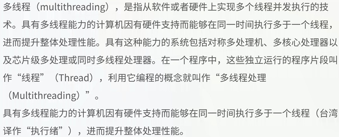
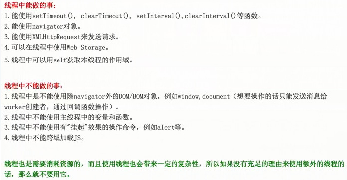

## JS多线程
- `Concurrent.Thread.js` 老的浏览器
- HTML5 `web workerer`

```
// 同步 alert， for
// 多线程 concurrent.thread.js

// 1 Concurrent.Thread.create 创建一个线程
Concurrent.Thread.create(function(){
	$('#id').click(function(){
		alert(1)
	});

	// 下面是一段特别复杂的函数
	for(var i=0;i<10000000;i++){
		console.log(i)
	};
});

// 2 script 标签创建线程
<script type="text/x-script.multithreaded-js">
	$('#id').click(function(){
		alert(1)
	});

	// 下面是一段特别复杂的函数
	for(var i=0;i<10000000;i++){
		console.log(i)
	};
</script>
```

#### 什么是多线程？

---

## HTML5 多线程 ，不允许操作DOM
````
var shareworker = new SharedWorker('index.js');
```

- postMessage(msg) 向创建线程的源窗口发消息
- onmessage 获取接受消息的事件
- important 导入其他js脚本，参数为脚本文件的url，可以导入多个脚本文件
- close() 结束线程
- navigator 对象
	1. 可以在local Storage 和 session Storage
	2. XMLHttpRequest可以在线程中使用ajax
	3. setTimeout, setInterval, 定时器可以使用线程

- 线程中不能做的事情

